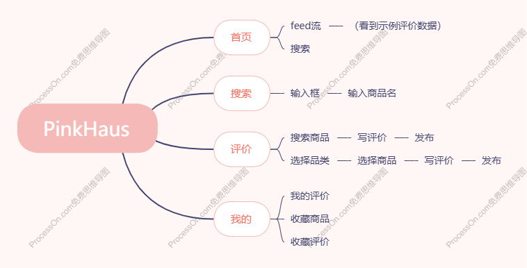
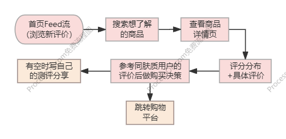
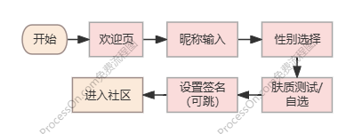

# PinkHaus — 好物测评社区 PRD

产品名称：PinkHaus（德语，「粉红小屋」）
文档版本：v1.0
日期：2026-04

## 1. 背景

### 1.1 背景

**粉红经济持续增长**

中国美妆护肤市场规模在 2025 年已突破 6000 亿元人民币，其中 Z 世代和千禧一代贡献了超过 60% 的消费力。"她经济"与"他经济"并行发展，男性护肤、成分护肤、功效护肤成为三大增长引擎。粉红经济（Pink Economy）不再只是女性的消费代名词——它代表着新一代消费者对"悦己消费"的坚定态度：愿意为自己花时间、花钱，但前提是——花得值。

消费降级≠消费降质

当前宏观经济增速放缓，消费者信心指数处于低位。但一个值得注意的趋势是：人们在减少非必要支出的同时，护肤美妆的刚需消费并未萎缩，而是发生了结构性迁移——从冲动式大牌消费转向理性研究、做足功课后的"精准投资"。

- 消费者不再轻易为广告和明星代言买单。他们开始：

- 在购买前搜索 3-5 个真实评价做决策

- 关注与自己有共同点的博主推荐而非品牌广告

- 在多个平台比价、比成分、比口碑

- 更愿意为高性价比的国货和功效型产品付费

- 测评社区的价值窗口已打开

- 然而，现有的信息渠道存在明显的信任缺口：

- 电商平台的评价水军泛滥，真假难辨

- 小红书的内容虽然丰富，但广告和软广混杂，肤质信息缺失

- 抖音/快手的短视频难以系统化检索和比价

- PinkHaus 正是切入这个空白的产物：以肤质为锚点、以真实评价为核心，帮助用户在信息过载的时代，用最短的时间找到真正适合自己的产品。

### 1.2 目标

- 产品使命（1.0）
让每一个想买护肤品的人，都能看到和自己同样肤质的真实用户的真实评价。

- 核心目标

- 解决"买错"的痛点：通过肤质标签 + 四档评分，帮助用户快速判断产品是否适合自己

- 降低"试错"成本：聚合大众评价，让用户在下单前看到足够多的真实反馈

- 建立"信任"闭环：拒绝广告和刷评，打造一个"只有用过才有发言权"的社区

- 业务目标

- 短期：验证产品形态，积累种子用户的真实评价数据

- 中期：建立"肤质+评价"数据库，成为美妆护肤消费决策的第一参考入口

- 长期：延伸至品类拓展、品牌合作、购物链路打通

## 2. 产品概述

### 2.1 产品定位

PinkHaus 是一个专注于化妆品和护肤品的真实测评内容社区。用户可通过简短的文字评价分享产品使用体验，并查看大众对目标商品的客观评价聚合，帮助做出购买决策。

### 2.2目标用户

| 用户画像 | 特征 |
| --- | --- |
| 美妆护肤消费者 | 关注产品功效，想了解真实口碑再下单 |
| 护肤成分党 | 关注肤质匹配度，想寻找同肤质用户的真实反馈 |
| 种草/拔草人群 | 喜欢分享和浏览美妆护肤内容 |

---

## 2.3设计风格
以低饱和粉作为主题配色，用户不易视觉疲劳且有特点；导航图标简约设计，色块和线条组合而成；胖胖体品牌标题，极简不失可爱。

## 3. 核心功能

### 3.1 商品评价系统

- 用户可对已用过的商品进行打分评价：

- 评分等级（四档）：

| 等级 | 名称 | 含义 |
| --- | --- | --- |
| 💖 PINK | Pink | 特殊评分：超级赞 |
| ❤️ 红榜 | Red | 推荐，值得入手 |
| 💛 黄榜 | Yellow | 一般，无功无过 |
| 🖤 黑榜 | Black | 不推荐，踩雷 |

---

- 评价流程：

- 选择商品（通过搜索框搜索或点击品类大图标浏览）

- 选择评分等级

- 填写使用感受文字评价

- 发布，自动同步至社区 Feed 流

### 3.2 商品搜索系统

- 内置 150+ 主流美妆护肤品牌商品数据库，输入商品名或品牌名即可自动匹配。

- 关键字搜索：支持商品名和品牌名的模糊匹配

- 语音搜索：基于 Web Speech API 的语音输入

- 品类浏览：通过品类图标大标签筛选商品类别

- 热门推荐：首页展示社区热评商品和热门品牌标签

### 3.3 社区 Feed 流

- 所有用户的评价按发布时间倒序排列

- 每条评价展示：用户头像、昵称、肤质标签、评分等级、评价内容、商品名

- 点击任意评价跳转至商品详情页

### 3.4 商品详情页

- 展示商品基本信息和分类

- 评分分布柱状图：PINK / 红 / 黄 / 黑 各等级的人数及百分比

- 评价列表：显示所有用户的评价及对应的肤质标签

### 3.5 用户体系

- 注册流程（多步递进）：

- 欢迎页 → 热情介绍 PinkHaus

- 输入昵称

- 选择性别（女生 / 男生 / 其他）

- 肤质选择（手动选择 或 肤质测试）

- （可选）个性签名

- 用户属性：

| 字段 | 说明 |
| --- | --- |
| 昵称 | 必填 |
| 性别 | 必填 |
| 肤质 | 必填（干/油/混油/混干/中性/敏感） |
| 个性签名 | 选填 |
| 主页背景 | 可选 9 种系统背景（纯色/条纹/波点，粉色最前推荐） |

---

### 3.6 个人主页

- 封面背景图（可切换款式）

- 圆形头像 + 昵称 + 性别 + 肤质标签

- 个性签名（点击即编辑）

- 我的评价 — 查看自己所有评价（Tab 带数量）

- 收藏商品 — 收藏的商品列表

- 收藏评价 — 收藏的其他用户的评价

## 4. 用户旅程及结构图

### 4.1 新用户旅程

### 4.2 回访用户旅程

### 4.3 结构图

## 5. 当前状态及下一步

### 5.1已实现功能

- 多步递进注册流程（昵称 → 性别 → 肤质 → 签名）

- 3 题肤质测试（自评 vs 测试）

- 混合性肤质子选项（混合-偏油 / 混合-偏干）

- 商品搜索（关键字 + 语音）

- 品类图标浏览（大图标 2列3行 + 其他整行）

- 品类商品选择页（粉色背景 + 品牌名展示）

- 四档评分 + 评价撰写

- 社区 Feed 流

- 商品详情页（评分分布 + 用户评价）

- 个人主页（封面背景、肤质、个性签名、收藏）

- 肤质标签展示（每条评价旁显示）

- 个人主页

- 蜜桃粉 UI 主题

- SVG 简约导航图标

- 内置 150+ 商品数据库 + 25 条示例评价

- 完整的前后端不分离的 localStorage 原型

### 5.2下一阶段功能

| 优先级 | 功能 | 说明 |
| --- | --- | --- |
| P0 | 后端 + 数据库 | 多用户在线、数据持久化 |
| P0 | 用户注册/登录 | 手机号/微信登录 |
| P1 | 点赞/评论互动 | 用户可对评价互动 |
| P1 | 同肤质筛选 | 只看某肤质用户的评价 |
| P1 | 商品图片 | 接入真实商品图 API |
| P2 | 购物平台关联 | 导入购买记录（浏览器插件） |
| P2 | 关注系统 | 关注特定用户，关注 Feed |
| P2 | 私信/聊天 | 用户间交流 |
| P3 | 品牌合作模块 | 官方品牌页、产品上新 |

---

## 6. 竞品分析

### 6.1 竞品全景图

| 产品 | 形态 | 核心功能 | 优势 | 劣势 | PinkHaus 差异点 |
| --- | --- | --- | --- | --- | --- |
| 小红书 | 综合内容社区 | 图文/视频笔记、商城、搜索 | 内容丰富、用户量大、种草心智强 | 广告软广混杂、肤质维度缺失、评价真假难辨 | 专注美妆护肤赛道 + 强制标注肤质 + 纯评价无广告 |
| 美丽修行 | 成分查询工具 | 成分分析、产品对比、肤质测试 | 成分数据专业、用户精准 | 社区互动弱、缺少种草氛围、界面工具化 | 侧重用户评价社区而非成分数据 |
| 透明标签 | 成分查询工具 | 成分解析、安全评分 | 成分数据全、界面简洁 | 用户评价少、社交属性几乎为零 | 社区驱动 + 评价聚合 |
| 淘宝/京东评价 | 电商附属功能 | 购买后评价、晒图 | 评价量大、带购买验证 | 水军刷评严重、无肤质参考、难以快捷对比 | 独立社区 + 肤质标签 + 评分分布可视化 |
| 抖音/快手 | 短视频平台 | 短视频种草、直播带货 | 传播力强、互动即时 | 信息碎片化、检索效率低、系统性不足 | 结构化评价 + 可搜索 + 可聚合 |
| 什么值得买 | 导购返利平台 | 好价推荐、晒物、社区 | 消费决策心智强 | 侧重「价格」非「肤质」、选品泛化 | 垂直美妆护肤 + 肤质匹配优先于价格匹配 |
| OnlyLady / 闺蜜网 | 美妆社区 | 产品点评、排行榜 | 品类垂直、用户积累久 | UI 老旧、移动端体验差、活跃度下降 | 现代 UI + 移动优先 + 多步注册降低门槛 |

---

### 6.2 核心竞争策略

- PinkHaus 不与大平台正面竞争，而是采取 "小而精"的差异化策略：

- 垂直聚焦：只做美妆护肤，不做泛内容。用户来的目的就是看产品评价，不存在"刷着刷着去看八卦了"的分心

- 肤质优先：所有评价强制绑定肤质，这是小红书、美丽修行都没有做到的维度

- 评价体系简洁直观：粉/红/黄/黑四档 + 数量分布，一秒看懂大众口碑，不需要看大段文字

- 低创作门槛：不需要拍图、不需要写长文、不需要剪辑视频，几句话就能分享使用体验

- UGC 纯净度：没有品牌入驻、没有 KOL 带货、没有广告投放，所有内容来自真实用户的真实使用

### 6.3 目标市场定位

- 初期切入点（TAM 中的 Niche）：

- 一二线城市 18-35 岁女性护肤消费者

- 关注成分和功效、有信息搜集习惯的"理性消费者"

- 对小红书广告疲劳、想要"干净评价"的精准用户群

- 扩展路径：

- 护肤 → 彩妆 → 身体护理 → 口服美容 → 家用美容仪

- 女性主导 → 男性护肤（增速最快的细分市场之一）

- 纯 UGC → 品牌合作内容（如"品牌直通车"栏目）

### 6.4 竞争壁垒构建

| 壁垒类型 | 构建方式 |
| --- | --- |
| 数据壁垒 | 肤质 + 评价的配对数据是独家的，用户越多数据越有价值 |
| 社区壁垒 | 同肤质用户之间的信任关系难以被竞品复制 |
| 品牌心智 | "买护肤品之前先查 PinkHaus" 是一个可植入的消费习惯 |
| 网络效应 | 评价越多 → 搜索越有价值 → 用户越多 → 评价越多 |

---
